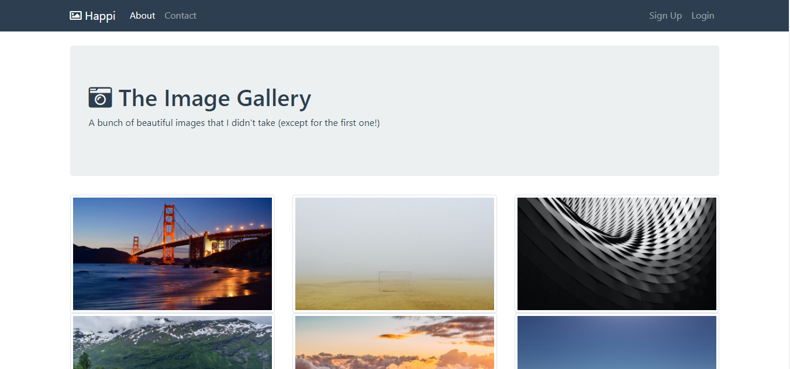

# My Personal Photo Album
A project to create a personal photo album (Stanley and Celestine)

## Built With

- HTML
- CSS
- JavaScript

## Live Demo

[Live Demo Link](https://raw.githack.com/happiguru/photo_gallery/featured-photo-gallery/index.html)

## Getting Started

**Navigation bar**
- Go to [My Personal Photo Album](https://rawcdn.githack.com/happiguru/photo_gallery/5ad9610e9bbf250c49604bd258b63d5843b50d0b/index.html) and have a look around, the purpose of this project is to create a photo personal photo album to test backend skills using only writtien codes without the using any backend framework.

To get a local copy  and to set it up and running follow these simple example steps.

### Prerequisites

- Browser
- Internet

- Download the code from repository (https://github.com/happiguru/photo_gallery/tree/featured-photo-gallery) and double click the index.html file

## Authors

👤 **Stanley Enow Lekunze**

- Github: [@happiguru](https://github.com/happiguru)
- Twitter: [@Lekunze_Nley](https://twitter.com/Lekunze_Nley)
- Linkedin: [lekunze-nley](https://www.linkedin.com/in/lekunze-nley/)

👤 **Ambe Celestine**

- Github: [@SunnySparks](https://github.com/sunnySparks)
- Twitter: [@JosFranT6](https://twitter.com/josfrant6)
- Linkedin: [linkedin](https://www.linkedin.com/in/josé-francisco-silva-díaz-a2a9421a6)

## Show your support

Give a ⭐️ if you like this project!

## Acknowledgments
-This project gave us a better understanding of the visual properties that must be used on a website.

## 📝 License

This project is [MIT](LICENSE) licensed.
